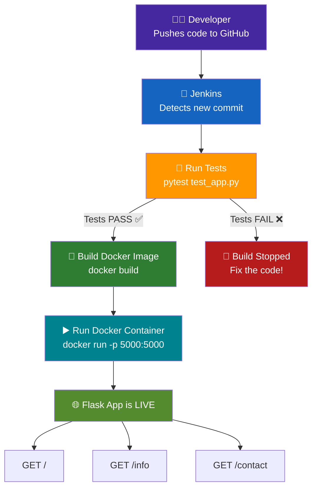

# 🐍 Flask Web App — Docker + Jenkins CI/CD Pipeline

> A Python Flask web application containerized with Docker and automated using Jenkins on AWS EC2  
> **Cloud DevOps Project — Thirumurugan S**

---

## 📌 What This Project Does

This project builds and automates a simple **Python Flask web app** using a full DevOps pipeline:

- ✅ A **Flask app** with 3 web pages (routes)
- ✅ **Pytest** unit tests to verify the app before deployment
- ✅ A **Dockerfile** to containerize the app using Red Hat UBI8
- ✅ A **Jenkins setup script** (`jenkins.sh`) that auto-installs Jenkins + Docker + Git on EC2
- ✅ Jenkins automatically runs tests → builds Docker image → runs the container

---

## 🏗️ Architecture



---

## 📁 Project Structure

```
DevOps-Projects/                 ← GitHub Repo Root
├── app.py                        ← Flask web application (3 routes)
├── test_app.py                   ← Pytest unit test for the app
├── Dockerfile                    ← Docker image build instructions (Red Hat UBI8)
└── jenkins.sh                    ← Shell script to set up Jenkins + Docker on EC2
```

🔗 GitHub Repo: [github.com/thirus2020/DevOps-Jenkins-Project](https://github.com/thirus2020/DevOps-Jenkins-Project.git)

---

## 🛠️ Tech Stack

| Layer | Technology |
|---|---|
| Language | Python 3 |
| Web Framework | Flask |
| Testing | Pytest |
| Container Base Image | Red Hat UBI8 |
| Containerization | Docker |
| CI/CD | Jenkins |
| Cloud | AWS EC2 (Amazon Linux / RHEL-based) |

---

## ✅ Prerequisites

Make sure these are installed before running locally:

- [ ] Python 3
- [ ] pip3
- [ ] Flask (`pip3 install flask`)
- [ ] Pytest (`pip3 install pytest`)
- [ ] Docker
- [ ] Git

---

## 🌐 Flask App — Pages & Routes

The app has **3 routes**:

| Route | What It Shows |
|---|---|
| `GET /` | Welcome to My Flask Application Home Page |
| `GET /info` | Welcome to DevOps Project |
| `GET /contact` | enquiry contact number |

App runs on **port 5000** by default (can be changed via `PORT` environment variable).

---

## 💻 Run Locally (Without Docker)

### Step 1 — Clone the repo

```bash
git clone https://github.com/thirus2020/DevOps-Jenkins-Project.git
cd DevOps-Jenkins-Project
```

### Step 2 — Install dependencies

```bash
pip3 install flask pytest
```

### Step 3 — Run the tests

```bash
pytest test_app.py -v
```

Expected output:
```
PASSED test_app.py::test_sktechopsmobilenumber
1 passed in 0.XXs
```

### Step 4 — Start the app

```bash
python3 app.py
```

Open in browser:
```
http://localhost:5000/
http://localhost:5000/info
http://localhost:5000/contact
```

---

## 🐳 Run With Docker

### Step 1 — Build the Docker image

```bash
docker build -t flask-devops-app .
```

### Step 2 — Run the container

```bash
docker run -d -p 5000:5000 flask-devops-app
```

### Step 3 — Open in browser

```
http://localhost:5000/
http://localhost:5000/info
http://localhost:5000/contact
```

### Useful Docker commands

```bash
# See running containers
docker ps

# Check container logs
docker logs <container-id>

# Stop the container
docker stop <container-id>

# Remove the image
docker rmi flask-devops-app
```

---

## 🖥️ Dockerfile Explained

```dockerfile
FROM redhat/ubi8          # Use Red Hat Universal Base Image 8

RUN yum install python3 -y  # Install Python 3
RUN pip3 install flask       # Install Flask

COPY app.py /app.py          # Copy the Flask app into the container

CMD ["python3", "/app.py"]   # Start the app when container runs
```

> 💡 The app listens on `host='0.0.0.0'` so it's accessible from outside the container.

---

## 🔧 Jenkins Setup — jenkins.sh

The `jenkins.sh` script **fully automates** the Jenkins + Docker environment setup on an AWS EC2 instance (Amazon Linux / RHEL-based). Just run it once and everything is ready.

### What the script installs:

| Tool | Why |
|---|---|
| Java 17 (Amazon Corretto) | Jenkins requires Java to run |
| Jenkins | CI/CD automation server |
| Docker | To build and run containers |
| Git | To pull code from GitHub |
| Python3-pip | To install Python packages |
| Flask + Pytest | To run the app and tests |

### How to use jenkins.sh on EC2

#### Step 1 — SSH into your EC2 instance

```bash
ssh ec2-user@<your-ec2-public-ip>
```

#### Step 2 — Download and run the script

```bash
# Option A — Clone the repo and run the script
git clone https://github.com/thirus2020/DevOps-Jenkins-Project.git
cd DevOps-Jenkins-Project
chmod +x jenkins.sh
sudo bash jenkins.sh
```

> ⚠️ The script ends with a **reboot** — this is needed to apply the Docker group membership for the `jenkins` user. After reboot, Jenkins will be ready.

#### Step 3 — Open port 8080 in AWS Security Group

1. Go to **EC2 Dashboard → Your Instance → Security Group**
2. Click **Edit Inbound Rules → Add Rule**
   - Type: `Custom TCP`
   - Port: `8080`
   - Source: `Anywhere`
3. Click **Save Rules**

#### Step 4 — Access Jenkins

```
http://<your-ec2-public-ip>:8080
```

Get the first-time admin password:

```bash
sudo cat /var/lib/jenkins/secrets/initialAdminPassword
```

---

## 🔧 Jenkins Job Configuration

Once Jenkins is running, create a job to automate: **test → build → run**.

### Step 1 — Install Plugins

Go to **Manage Jenkins → Manage Plugins → Available** and install:

- ✅ Git Plugin
- ✅ Docker Pipeline Plugin
- ✅ ShiningPanda (for Python/Pytest support)

### Step 2 — Create a Freestyle Job

- Click **New Item** → **Freestyle project** → Name: `FlaskApp-CICD`

### Step 3 — Connect to GitHub

Under **Source Code Management → Git**:
```
DevOps-Jenkins-Project
```

### Step 4 — Add Build Steps

Under **Build → Execute Shell**, add these commands in order:

```bash
# Step 1: Run tests
pip3 install flask pytest
pytest test_app.py -v

# Step 2: Build Docker image
docker build -t flask-devops-app .

# Step 3: Stop old container if running
docker stop flask-container || true
docker rm flask-container || true

# Step 4: Run new container
docker run -d -p 5000:5000 --name flask-container flask-devops-app
```

### Step 5 — Build Now

Click **Build Now** → check **Console Output** → you should see:

```
PASSED test_app.py::test_sktechopsmobilenumber
Successfully built <image-id>
Successfully tagged flask-devops-app:latest
Finished: SUCCESS
```

✅ App is now live at:
```
http://<ec2-public-ip>:5000/
```

---

## 🧪 Unit Test Explained

`test_app.py` tests the `/contact` route directly:

```python
from app import sktechopsmobilenumber

def test_sktechopsmobilenumber():
    assert sktechopsmobilenumber() == \
      '<h1 style="color:red;">FOR TRAINING ENQUIRY: +91 9791726644</h1>'
```

Run manually:
```bash
pytest test_app.py -v
```

---

## 🐞 Troubleshooting

| Problem | Cause | Fix |
|---|---|---|
| `docker: permission denied` | Jenkins user not in docker group | Run `sudo gpasswd -a jenkins docker` then reboot |
| Port 5000 already in use | Another app using the port | Run `docker stop flask-container` then retry |
| Jenkins not starting | Java not installed | Run `java -version` to check; reinstall if needed |
| Pytest not found | pip3 packages not installed | Run `pip3 install flask pytest` |
| `yum: command not found` | Wrong OS (Ubuntu/Debian) | Use `apt` instead of `yum` in the script |

---

## ✅ What We Built

| Feature | Done |
|---|---|
| Flask app with 3 routes | ✅ |
| Pytest unit test | ✅ |
| Dockerized with Red Hat UBI8 | ✅ |
| Jenkins auto-setup script | ✅ |
| Full CI/CD: test → build → deploy | ✅ |

---

## 👤 Author

**THIRU**   
🔗 [github.com/thirus2020](https://github.com/thirus2020)
